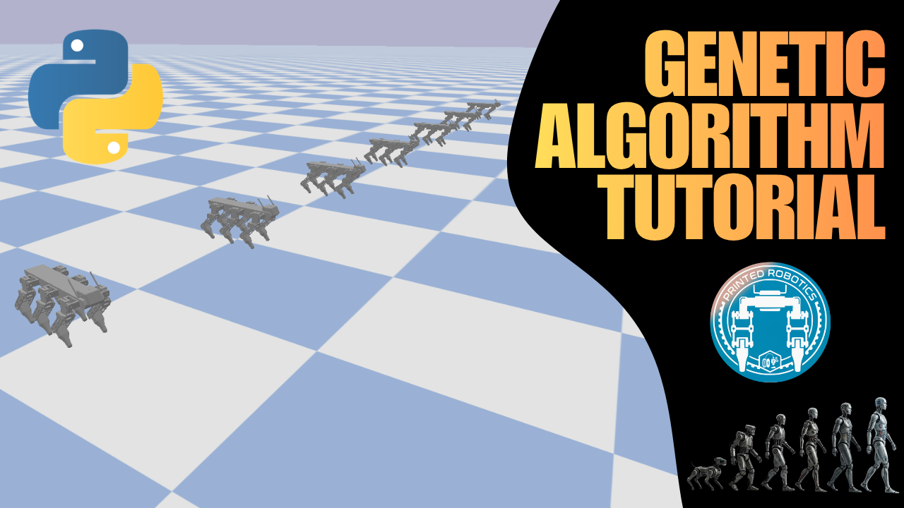

# HexaDog ZBD — Genetic Algorithm Gait Optimizer

A PyBullet-based genetic algorithm (GA) framework for evolving locomotion gaits on the **HexaDog ZBD**, a six-legged (3-DOF per leg) hexapod robot. The optimizer searches for gait parameters (step amplitude and frequency) that best match a target velocity across four locomotion modes — **straight**, **sideway**, **diagonal**, and **spin** — and saves the best-performing individuals to a CSV. A separate replay script loads that CSV and visually plays back each optimized gait in the PyBullet GUI.

---

## Repository contents

```
.
├── ZBD_genetic_algorithim_opt.py   # GA optimizer (produces gait_results.csv)
├── best_robots_replay.py           # Visual replay of results from gait_results.csv
├── HexaDog_ZBD.urdf                # Robot description
├── meshes/                         # STL meshes referenced by the URDF
├── requirements.txt
└── README.md
```

---

## 1. Clone the repository

```bash
git clone https://github.com/serdarselimys/PyBullet-GeneticAlgorithm.git
cd PyBullet-GeneticAlgorithm
```

## 2. Install dependencies

Python 3.9+ is recommended. Using a virtual environment is strongly encouraged:

```bash
python -m venv .venv
# Linux / macOS:
source .venv/bin/activate
# Windows (PowerShell):
.venv\Scripts\Activate.ps1

pip install -r requirements.txt
```

`requirements.txt` installs `pybullet`, `numpy`, `pandas`, and `tqdm`.

---

## 3. Running the optimizer

The optimizer is `ZBD_genetic_algorithim_opt.py`. Run it from the repo root so it can locate the URDF and mesh files:

```bash
python ZBD_genetic_algorithim_opt.py
```

When it finishes it writes **`gait_results.csv`** to the current directory, containing the best gait found for every (mode × direction × experiment) combination.

### Key settings (top of the file)

Open the script and edit the constants in sections **0** and **1** to configure a run:

| Setting | Meaning |
|---|---|
| `MODES` | Any subset of `["straight", "sideway", "diagonal", "spin"]`. |
| `NUM_ROBOTS` | Population size per generation (robots simulated in parallel in a scene). |
| `GAIT_TRIALS` | Number of GA generations. |
| `DURATION` | Length of each trial in seconds. |
| `NUM_EXPERIMENTS` | Independent GA repeats per configuration. |
| `RENDER_MODE` | `"headless"` (fast, no window) or `"windowed"` (opens the PyBullet GUI). |
| `TARGET_SPEEDS` | Target forward/side/diagonal speeds in m/s. |
| `TARGET_ROT_SPEEDS` | Target rotational speeds in rad/s (spin mode only). |
| `BODY_HEIGHTS`, `STEP_HEIGHTS` | Body height and foot lift, in meters. |
| `DIRECTIONS` | `+1` / `-1` for straight, sideway, spin. Empty list `[]` skips those modes. |
| `DIAGONAL_DIRECTIONS` | Heading angles in degrees for diagonal mode (e.g. `[45, 135]`). Empty list `[]` skips diagonal. |
| `GENE_BOUNDS` | GA search range for `step_amplitude` and `frequency`. |
| GA hyperparameters | `ELITE_COUNT`, `TOURNAMENT_SIZE`, `CROSSOVER_RATE`, `MUTATION_RATE`, `MUTATION_SIGMA`. |

The script builds the full task grid across every mode, gait, target speed, body/step height, and direction, then runs them in parallel across `cpu_count() - 1` worker processes using headless PyBullet instances. Progress is shown via a `tqdm` bar.

### Tips

- Start with `RENDER_MODE = "headless"` — it's dramatically faster. Only switch to `"windowed"` when debugging a single configuration.
- Increase `NUM_ROBOTS` and `GAIT_TRIALS` for better solutions at the cost of runtime.
- If you only care about one mode (e.g. spin), set `MODES = ["spin"]` and clear the unused direction lists.

---

## 4. Replaying the best robots

Once `gait_results.csv` exists, visualize the optimized gaits with:

```bash
python best_robots_replay.py
```

This opens the PyBullet GUI, spawns the HexaDog, and replays each row of the CSV in order of decreasing score, printing per-trial metrics (distance, speed, drift, rotation) to the terminal.

### Options (top of the file)

| Setting | Meaning |
|---|---|
| `CSV_PATH` | Path to the results CSV (default `"gait_results.csv"`). |
| `TOP_N` | `None` replays every row; set to an integer to only replay the top N. |
| `DURATION` | Seconds each trial is played back. |

The replay script auto-detects each row's `mode` and dispatches to the correct trajectory generator, so a single CSV mixing all four modes will play back correctly.

---

## Troubleshooting

- **`FileNotFoundError: HexaDog_ZBD.urdf`** — run the scripts from the repo root so the URDF and `meshes/` folder are found next to them.
- **URDF loads but meshes are missing / robot appears invisible** — make sure the `meshes/` folder is present and its relative paths inside the URDF are intact.
- **`gait_results.csv` is empty or missing a `mode` column** — regenerate it with the current version of `ZBD_genetic_algorithim_opt.py`; the replay script requires the unified schema.
- **GUI won't open on a headless server** — that's expected. Use `RENDER_MODE = "headless"` for the optimizer, and run the replay script on a machine with a display.

---

Licensing & Commercial Use

These files are licensed under the Creative Commons Attribution–NonCommercial 4.0 International (CC BY-NC 4.0) license.

You are free to remix, adapt, and build upon this design for non-commercial purposes, as long as you give appropriate credit.

You may not use the material for commercial purposes of any kind.

Link: https://creativecommons.org/licenses/by-nc/4.0/
